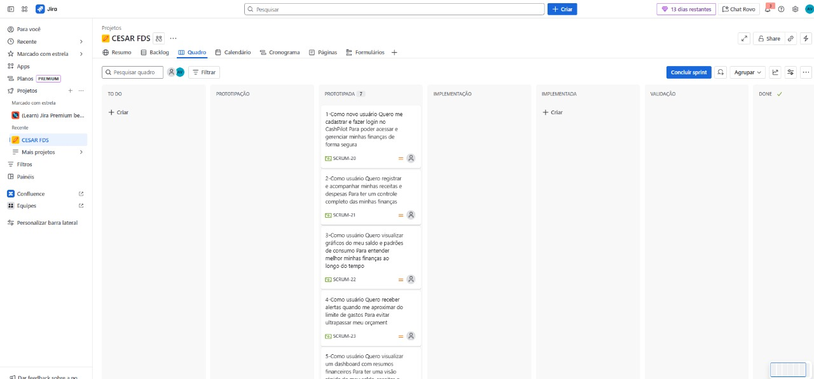
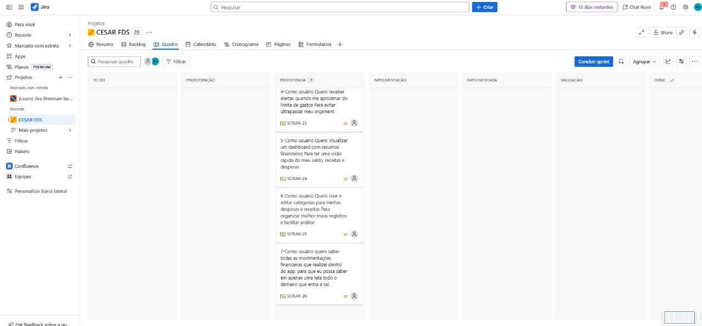
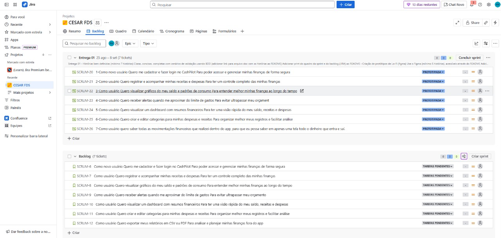

# CashPilot – Planner Financeiro Pessoal 💵

O **CashPilot** é um planner financeiro pessoal projetado para ajudá-lo a gerenciar suas finanças de forma prática e eficiente.  

- **Controle de receitas e despesas:** acompanhe todos os seus gastos e entradas em um só lugar.  
- **Gráficos de evolução financeira:** visualize o crescimento do seu saldo e padrões de consumo ao longo do tempo.  
- **Alertas de limite de gastos:** receba notificações automáticas ao se aproximar do limite definido, evitando surpresas no final do mês.  

Com o CashPilot, planejar e organizar seu orçamento fica mais simples e seguro!

# Funcionalidades do CashPilot ⚙️

O **CashPilot** oferece ferramentas completas para gerenciar suas finanças pessoais de forma simples e eficiente:

- **Controle de receitas e despesas**  
  Registre e acompanhe todas as entradas e saídas de dinheiro em um só lugar.

- **Gráficos de evolução financeira**  
  Visualize de forma clara a evolução do seu saldo e os padrões de consumo ao longo do tempo.

- **Alertas de limite de gastos**  
  Receba notificações automáticas ao se aproximar dos limites definidos, ajudando a manter o orçamento sob controle.

- **Dashboard intuitivo**  
  Tenha uma visão geral rápida de suas finanças, com resumos diários, semanais ou mensais.

- **Categorias personalizáveis**  
  Organize despesas e receitas por categorias, facilitando a análise detalhada dos gastos.

- **Exportação de dados**  
  Exporte relatórios em CSV ou PDF para acompanhar e planejar suas finanças com mais precisão.

  
<h2><strong>Entrega 1</strong></h2>

   
  
  O objetivo desta primeira entrega é apresentar um vislumbre das fases iniciais do projeto CashPilot. Demonstramos parte de suas funcionalidades e os caminhos de evolução, já que aprimorar a experiência do usuário será fundamental para o desenvolvimento do site. Essa base servirá como ponto de partida para a evolução do nosso trabalho, permitindo ajustes e novas implementações nas próximas etapas.
   
   
  

   
    
    
    
</a>
    
  

  ### Quadro
  
  
  

  ### Backlog
  

  
<h2><strong>Entrega 2</strong></h2>

   
  
  Dando continuidade ao projeto, iniciamos sua execução de forma prática. Nosso foco, durante esta entrega, foi utilizar três histórias de usuário previamente definidas pelo grupo. Nesta etapa, tivemos um primeiro entendimento do potencial do projeto ao colocarmos em prática a primeira entrega, o que nos preparou de forma mais sólida para o desenvolvimento das próximas fases.
   
   
  

    
  
    
  

  ### Relato da programação em par 
  Dupla: Bernardo e André Borges:
  A programação em dupla foi feita da seguinte maneira, Bernardo começava a fazer o código enquando André tentava perceber algum possível erro. André também ficava comentando possíveis melhorias e relatava pontos com uma ótica diferente acerca do código.

  Membros: Luiz Eduardo, Bernardo, André, Vinicios, Júlio:
  Trabalhando em cojunto desenvolvemos a parte do backend para as páginas de login e logout, de forma que Bernardo e Luiz Eduardo escreveram o código enquanto os outros assumiram a função de corretores do código e propuseram comentários de melhorias.

  

    
  

  

 
  

